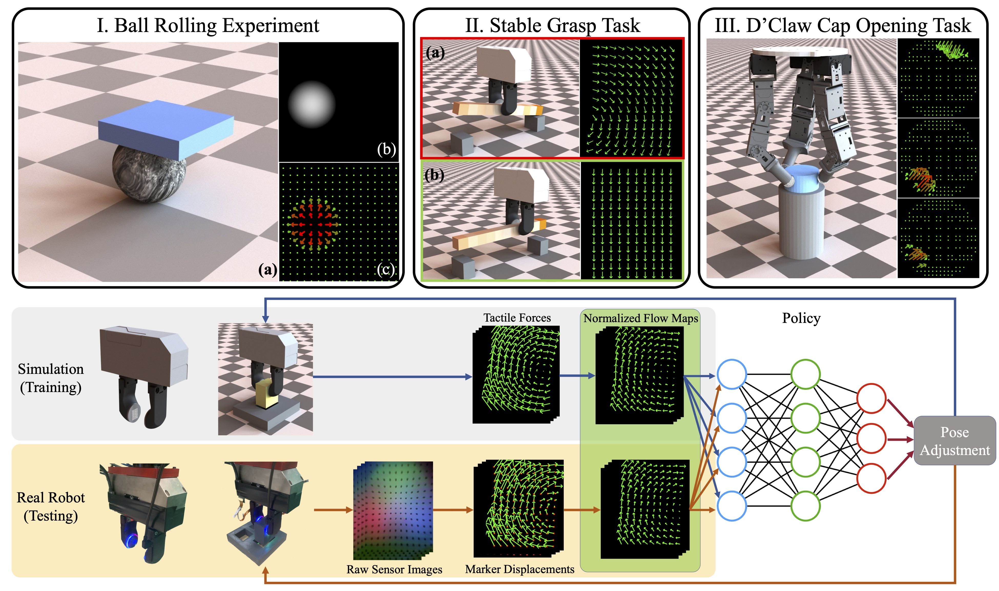
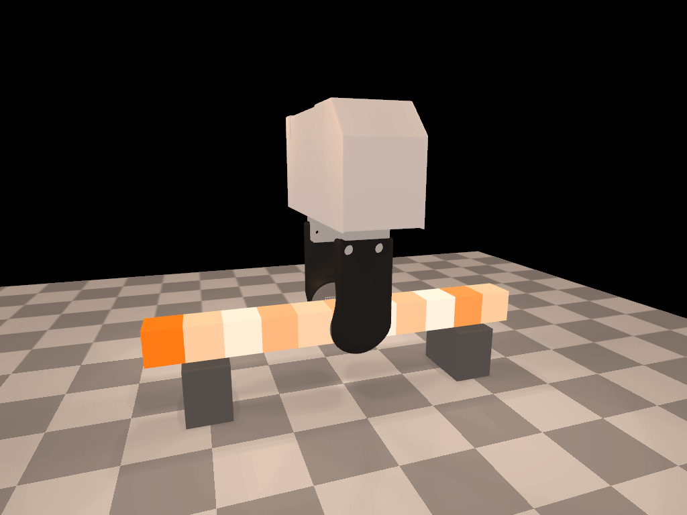
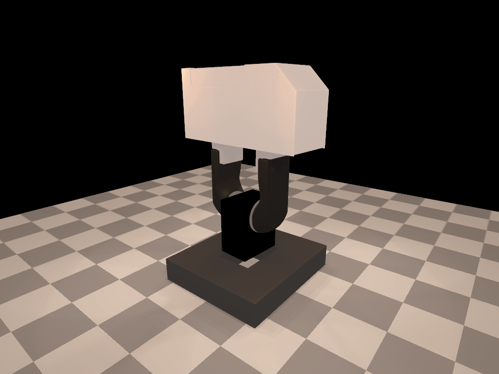

# Tactile-Based Control Environments

This repository contains the implements for the paper [Efficient Tactile Simulation with Differentiability for Robotic Manipulation](http://people.csail.mit.edu/jiex/papers/TactileSim/index.html) (**CoRL 2022**). 

In this paper, we developed an efficient tactile simulator ([DiffRedMax](https://github.com/eanswer/DiffHand)) for simulating dense field of both tactile normal forces and tactile shear forces. Our tactile simulator is highlighted by its high speed, tactile representation flexibility, differentiability and sim-to-real capability. Our simulator also provides user-friendly Python interface and the differentiable simulator can be simply plugged in as a PyTorch layer as shown in the examples in this repository. This repository contains the examples we show in the paper.

<p align="center">
    
</p>


## Installation

**Operating System**: tested on Ubuntu 16.04 and Ubuntu 18.04

1. Clone the project and its submodule from github: `git clone git@github.com:eanswer/TactileSimulation.git --recursive `.

2. Install **CMake** >= 3.1.0: [official instruction for cmake installation](https://cmake.org/install/)

3. Create conda environment from `environment.yml` 

   ```
   conda env create -f environment.yml
   conda activate tactile_control_env
   ```

5. Install `DiffRedMax`

   ```
   cd externals/DiffHand/core
   python setup.py install
   ```

6. Install` pytorch-a2c-ppo-acktr-gail`

   ```
   cd externals/pytorch-a2c-ppo-acktr-gail
   pip install -e .
   ```


## Code Structure

The examples in the paper are in the `examples` folder. Each example is corresponding to a subfolder.


## Run the examples in the paper

#### Rolling Ball Experiment

```
cd examples/RollingBallExp
python test_sim_speed.py [--render]
```

If run with `--render` flag, it will first show two windows (as shown first row below) showing animated depth map of normal tactile force field (left) and animated tactile force field (right). Then it will show the simulation animation (second row).

<p align="center">
    
  </p>

<p align="center">
    </p>

#### Stable Grasp Example

We provide the environment of the tactile-based stable grasp task. The environment can be tested via:

```
cd examples/StableGraspExp
python test_stable_grasp_env.py
```

This scripts runs a random control policy to test the environment. It will also first show two windows showing tactile force fields on two gripper fingers (as shown first row below). If you press `[Esc]`, it will then show the rendered simulation of the grasp attempts. If you press `[Esc]`, it will exit the simulation of this attempt, and enter the next attempt, and showing the tactile force fields and rendered simulation again, and so on.

<p align="center">
    </p>

#### D'Claw Rotating Cap Example

```
cd examples/DClawExp
python test_dclaw_env.py
```

<p align="center">
    </p>

#### Differentiability: Tactile-Base Pushing Example

We provide the training scripts for the experiments in the paper, which includes the gradient-based policy optimizations with privilege state info, tactile observation, and no-tactile reduced observation respectively, and also the PPO training scripts with tactile observation. To run the experiments in the `examples/TactilePushExp` folder, and follow the commands below:

##### Gradient-based policy optimization with tactile observation:

```
python train_tactile_push_gd.py --cfg ./cfg/gd_tactile.yaml --logdir ./trained_models/tactile/gd
```

##### Gradient-based policy optimization with privilege state observation:

```
python train_tactile_push_gd.py --cfg ./cfg/gd_privilege.yaml --logdir ./trained_models/privilege/gd
```

##### Gradient-based policy optimization with no-tactile reduced observation

```
python train_tactile_push_gd.py --cfg ./cfg/gd_no_tactile.yaml --logdir ./trained_models/no-tactile/gd/
```

##### PPO policy optimization with tactile observation

```
python train_tactile_push_ppo.py --cfg ./cfg/ppo_tactile.yaml --logdir ./trained_models/tactile/ppo
```


#### Tactile Insertion Experiment

We provide the simulation code for our sim-to-real tactile insertion experiment, run it with:

````
cd examples/TactileInsertionExp
python train_tactile_insertion_ppo.py
````

<p align="center">
    </p>


## Citation

If you find our paper or code is useful, please consider citing:

```
@INPROCEEDINGS{xu2022efficient,
    TITLE     = {Efficient Tactile Simulation with Differentiability for Robotic Manipulation},
    AUTHOR    = {Jie Xu and Sangwoon Kim and Tao Chen and Alberto Rodriguez Garcia and Pulkit Agrawal and Wojciech Matusik and Shinjiro Sueda},
    BOOKTITLE = {6th Annual Conference on Robot Learning},
    YEAR      = {2022},
    URL       = {https://openreview.net/forum?id=6BIffCl6gsM}
} 
```

```
@INPROCEEDINGS{Xu-RSS-21, 
    AUTHOR    = {Jie Xu AND Tao Chen AND Lara Zlokapa AND Michael Foshey AND Wojciech Matusik AND Shinjiro Sueda AND Pulkit Agrawal}, 
    TITLE     = {{An End-to-End Differentiable Framework for Contact-Aware Robot Design}}, 
    BOOKTITLE = {Proceedings of Robotics: Science and Systems}, 
    YEAR      = {2021}, 
    ADDRESS   = {Virtual}, 
    MONTH     = {July}, 
    DOI       = {10.15607/RSS.2021.XVII.008} 
} 
```

